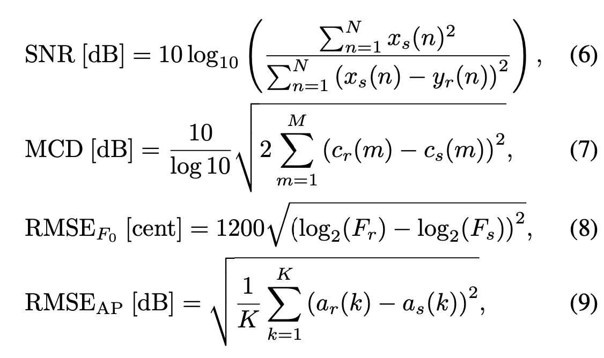

#  Vocoder Evaluator

A python package for evaluating performance of vocoder,
which implemented the evaluation methods mentioned in papar [AN INVESTIGATION OF MULTI-SPEAKER TRAINING FOR WAVENET VOCODER](https://github.com/kan-bayashi/PytorchWaveNetVocoder)



# installation

**normal installaiton**
```
pip install git+https://github.com/exeex/vocoder_eva.git
```


**for develop**

```
git clone https://github.com/exeex/vocoder_eva.git vocoder_eva
cd vocoder_eva
python setup.py develop
```

# Example

**for single file**
```Python
from vocoder_eva.eval import eval_rmse_f0
import librosa

file_raw = 'demo/exmaple_data/ground_truth/arctic_b0436.wav'
file_syn = 'demo/exmaple_data/no_pulse/arctic_b0436.wav'

aud_r, sr_r = librosa.load(file_raw, sr=None)
aud_s, sr_s = librosa.load(file_syn, sr=None)

assert sr_r == sr_s
if len(aud_r) != len(aud_s):
    aud_r = aud_r[:len(aud_s)]
    aud_s = aud_s[:len(aud_r)]

rmse_f0 = eval_rmse_f0(aud_r, aud_s, sr_r)
print(rmse_f0)

```

**for data folders**

see [demp.py](https://github.com/exeex/vocoder_eva/blob/master/demo/demo.py)